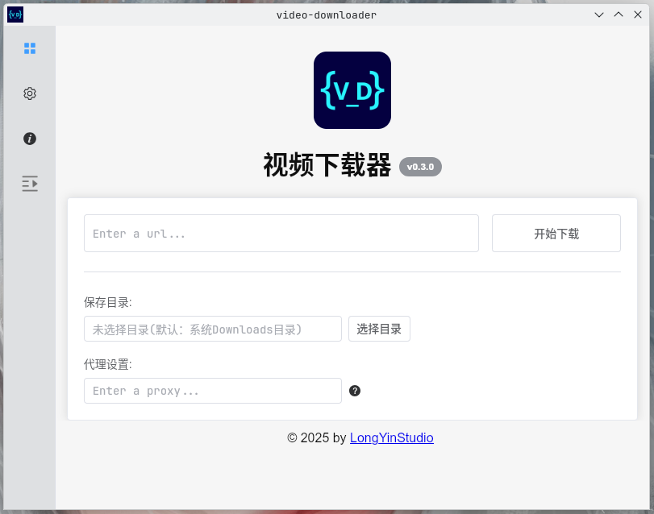
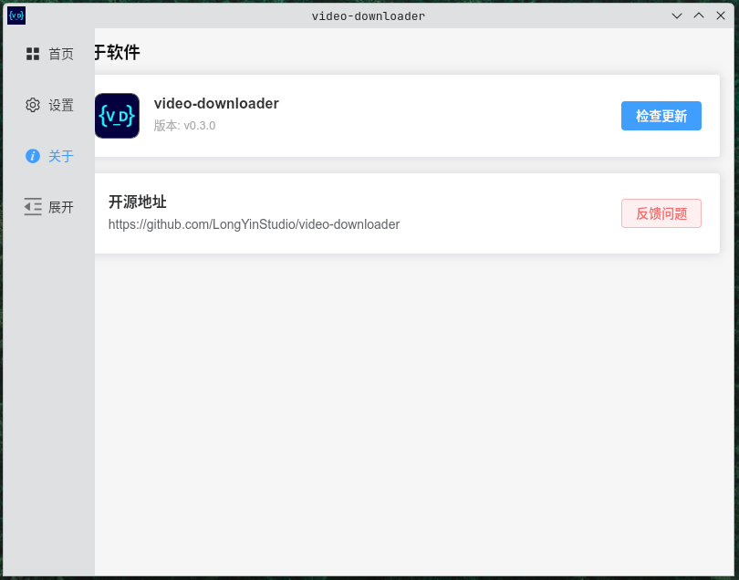

# Videos Downloader

<div align="center">
    
</div>

<div align="center">
    <div>
       <a href="./README.md">简体中文</a> |  English
    </div>
    <div>
      
      
      
    </div>
</div>

## Screenshots




## depends

- Make sure [ffmpeg](https://ffmpeg.org/download.html) is in your system path.
  > Note: FFmpeg does not affect the download, only affects the final file merge.

## 安装

1. Archlinux

   > video-downloader-longyinstudio(aur)

```bash
yay -S video-downloader-longyinstudio
Or
paru -S video-downloader-longyinstudio
```

2. Others

   > Download the installation package ending in from the Latest [Release](https://github.com/LongYinStudio/video-downloader/releases/latest) page.
